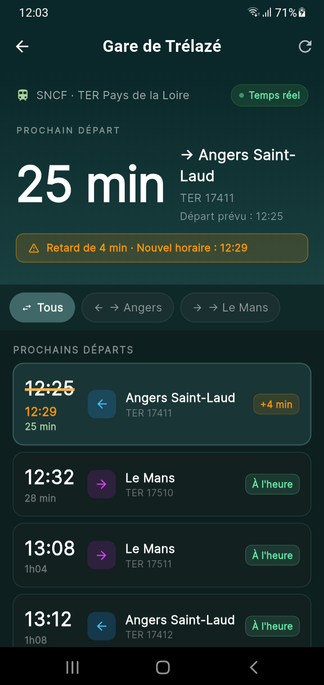

<div align="center">

# My Trélazé 📱

### L'application citoyenne indépendante de Trélazé

[](https://flutter.dev)
[](https://android.com)
[](https://firebase.google.com)
[](#)

> ⚠️ Application citoyenne non officielle — non affiliée à la Mairie de Trélazé

---

### 📸 Aperçu

<p align="center">
  
  &nbsp;
  
  &nbsp;
  
  &nbsp;
  
</p>

</div>

---

## ✨ Fonctionnalités

| Écran | Description |
|---|---|
| 🏠 **Accueil** | Météo en direct, dernières actus, accès rapide |
| 🚌 **Transport** | Horaires Irigo (bus) et SNCF en temps réel |
| 📰 **Actualités** | France 3 Anjou, Angers.fr |
| 🗺️ **Plan** | Carte interactive de la ville |
| 🗑️ **Déchets** | Calendrier de collecte |
| 🍽️ **Restaurants** | Adresses et horaires |
| 📅 **Agenda** | Événements de la ville |
| 🔔 **Notifications** | Alertes citoyennes push |
| 🚨 **Signalement** | Voirie, éclairage, graffiti… |

---

## 🛠️ Stack technique

<div align="center">


</div>

---

## 🚀 Installation

```bash
git clone https://github.com/Dinazcashdz/App-MyTrelaze.git
cd App-MyTrelaze
cp lib/config/secrets.example.dart lib/config/secrets.dart
# Remplir les clés API dans secrets.dart
flutter pub get
flutter run
```

---

## 📍 À propos

Application développée pour les habitants de **Trélazé (49800), Maine-et-Loire**.  
Conçue avec Flutter pour Android & iOS.

---

<div align="center">

Made with ❤️ pour Trélazé

</div>
