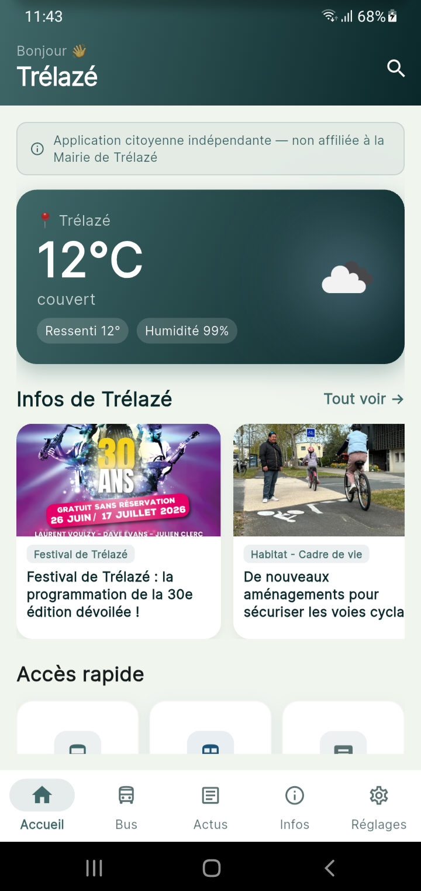
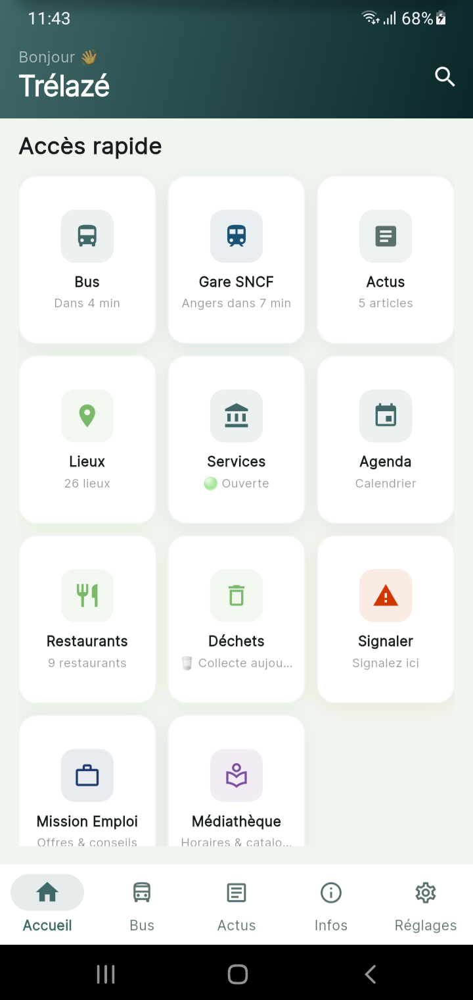
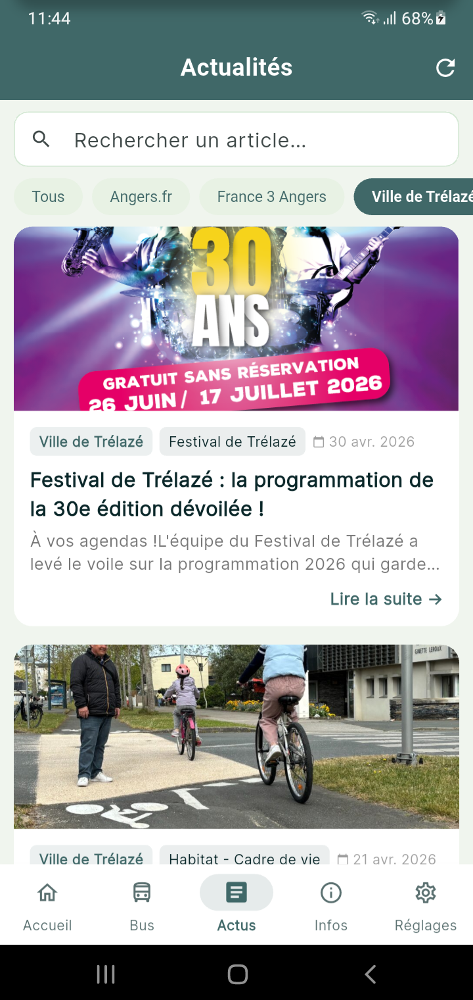

# My Trélazé 📱

**L'application citoyenne indépendante de Trélazé (49800)**

> Application non officielle — non affiliée à la Mairie de Trélazé.

---

## Aperçu

<p align="center">
  
  
  
</p>

---

## Fonctionnalités

- 🏠 **Accueil** — Météo en direct, dernières actus, accès rapide aux services
- 🚌 **Transport** — Horaires Irigo (bus) et SNCF en temps réel
- 📰 **Actualités** — France 3 Anjou, Angers.fr
- 🗺️ **Plan de la ville** — Carte interactive
- 🗑️ **Déchets** — Calendrier de collecte
- 🍽️ **Restaurants** — Adresses et horaires
- 📅 **Agenda** — Événements de la ville
- 🔔 **Notifications push** — Alertes citoyennes
- 🚨 **Signalement citoyen** — Voirie, éclairage, graffiti…

---

## Ajouter des screenshots

1. Lance l'app sur ton émulateur ou téléphone
2. Prends des captures (sur Android : `flutter screenshot`)
3. Crée un dossier `screenshots/` à la racine du repo
4. Dépose tes images dedans et fais un `git push`
5. Dans ce README, décommente le bloc `<p align="center">` ci-dessus

---

## Stack technique

- **Flutter** 3.x (Dart)
- **Firebase** (Firestore, Messaging, Storage)
- **Google Maps** + flutter_map
- **Google Mobile Ads** (AdMob)
- **OpenWeather API**

---

## Installation

```bash
git clone https://github.com/Dinazcashdz/App-MyTrelaze.git
cd App-MyTrelaze
cp lib/config/secrets.example.dart lib/config/secrets.dart
# Remplir les clés API dans secrets.dart
flutter pub get
flutter run
```

---

## Licence

Application citoyenne indépendante — © 2026
